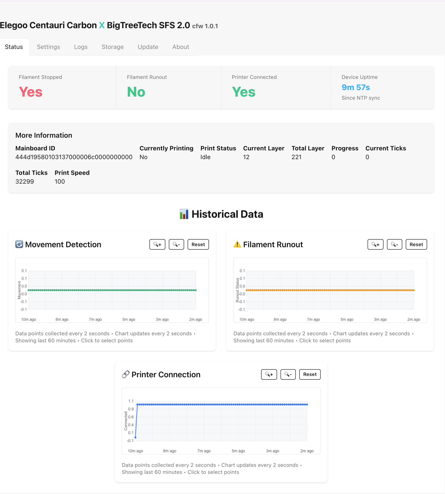
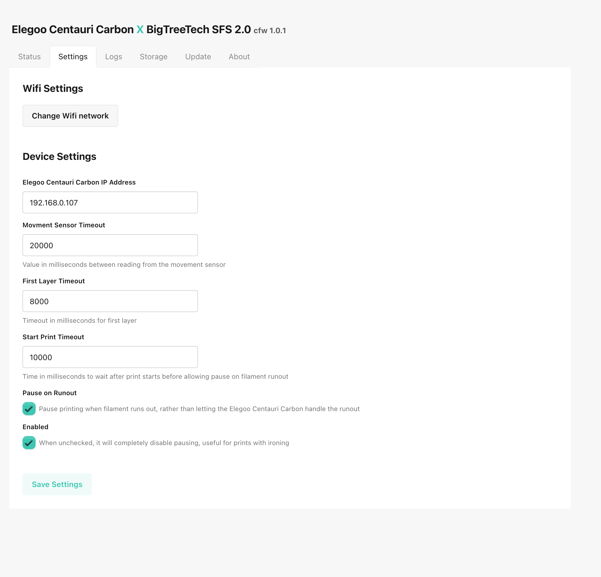
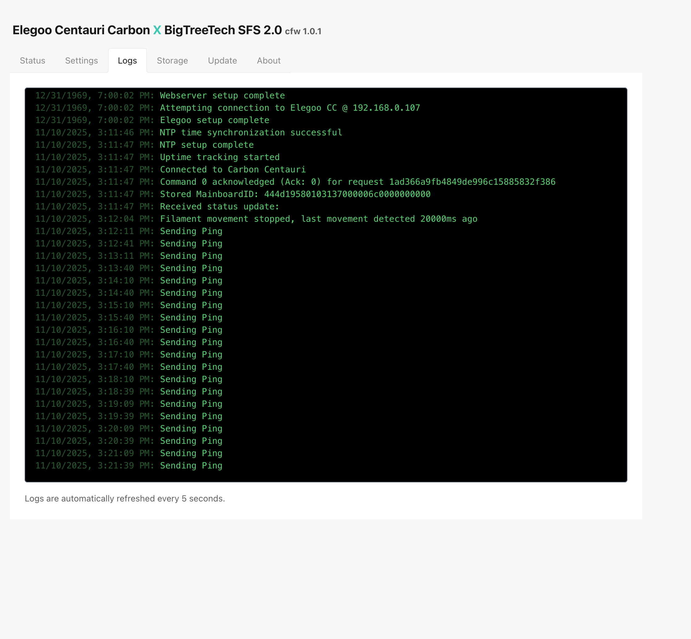
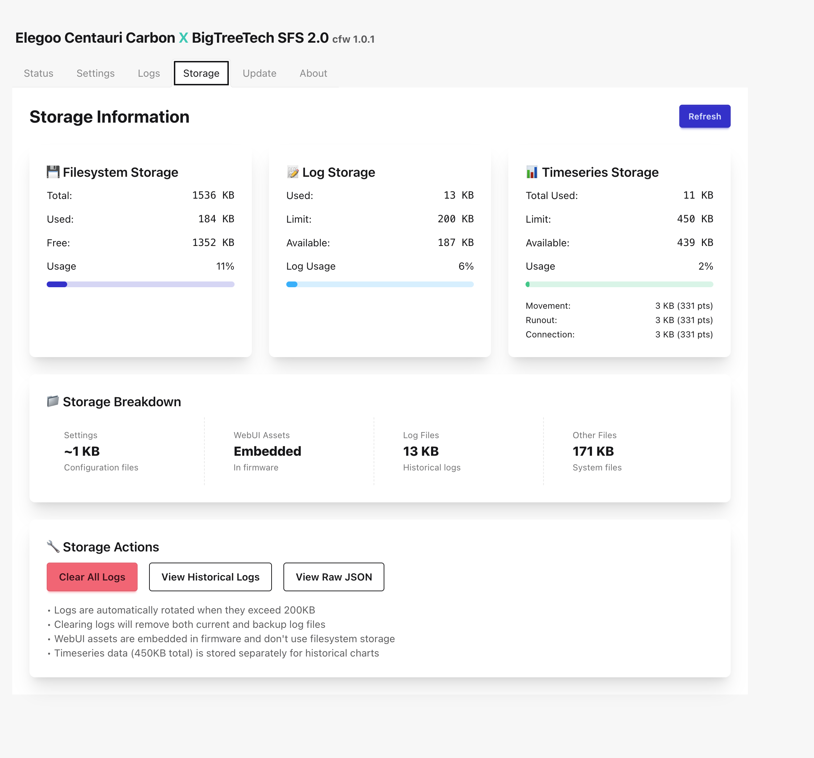
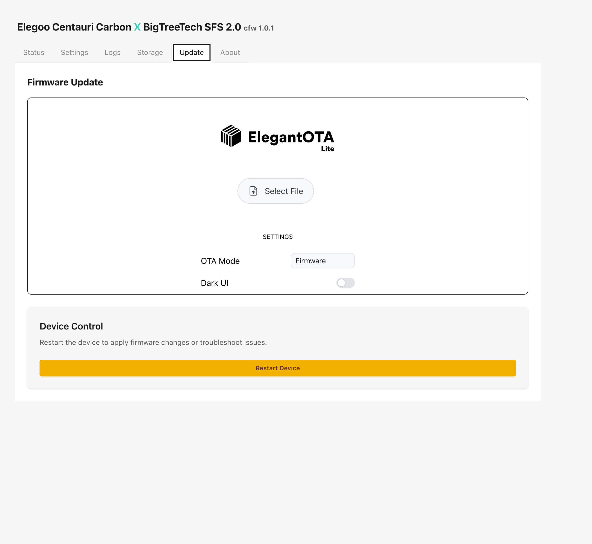
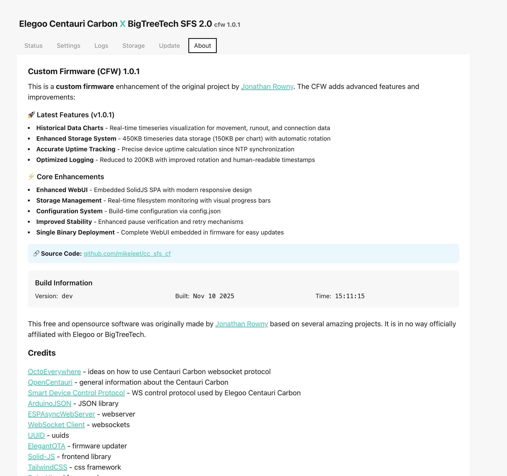

# ESP32 Filament Sensor for Elegoo Carbon Centauri

An **enhanced and modernized** filament sensor system that adds movement detection to the Elegoo Carbon Centauri 3D printer. This ESP32-based solution monitors filament flow and automatically pauses prints when filament stops moving, preventing failed prints due to tangles, breaks, or feed issues.

> **🚀 Enhanced Fork**: This is a significantly improved version of the [original cc_sfs project](https://github.com/jrowny/cc_sfs) with major upgrades to reliability, user experience, and functionality.

## Key Enhancements Over Original

### 🎯 **Reliability Improvements**
- **Smart Pause Verification**: Monitors printer status after pause commands with automatic retry logic (up to 5 configurable attempts) - configurable via Settings tab or `config.json`
- **Enhanced State Management**: Prevents duplicate commands and handles edge cases that caused the original to fail on subsequent runouts
- **Robust Error Handling**: Comprehensive logging and recovery mechanisms

### 🌐 **Modern Web Interface**
- **Fully Embedded WebUI**: Complete SolidJS-based interface embedded in firmware (no separate filesystem upload needed)
- **Interactive Timeseries Charts**: Real-time data visualization with 2-second intervals
- **Responsive Design**: Modern UI with TailwindCSS and DaisyUI components
- **Live System Monitoring**: CPU usage, memory stats, WiFi signal strength, and storage analytics

### ⚙️ **Advanced Configuration**
- **Build-time Configuration**: Pre-configure settings via `config.json` for automated deployments
- **Runtime Web Configuration**: All settings adjustable through intuitive web interface
- **Multiple Board Support**: ESP32, ESP32-S3, and Seeed XIAO ESP32S3 with board-specific optimizations
- **Flexible Timeout Settings**: Separate timeouts for first layer, normal printing, and print start detection

### 🔧 **Developer Experience**
- **Automated Build System**: Single script handles WebUI build, embedding, and firmware compilation
- **OTA Updates**: Complete firmware updates via web interface
- **Comprehensive Logging**: Detailed logs with filtering and export capabilities
- **Mock Development Server**: WebUI development with simulated sensor data

## Core Features

- **Real-time filament movement detection** using BTT SFS 2.0 sensor
- **WebSocket integration** with Elegoo Carbon Centauri printer
- **Smart pause verification system** with configurable retry logic (up to 5 attempts) - adjustable via Settings tab or `config.json`
- **Timeseries data storage** with interactive web-based charts
- **System health monitoring** with detailed analytics
- **Over-the-air firmware updates** via embedded web interface

## Quick Start

### 🚀 Easy Firmware Building & OTA Updates

**Simple Build Script:**
```bash
./build_firmware.sh
```

**Two Build Options:**
1. **Default (AP Mode)** - Device creates WiFi hotspot for initial setup
2. **Pre-configured** - Uses `config.json` for automatic WiFi connection

**OTA Updates:**
- Access `http://ccxsfs20.local/update` 
- Upload `firmware.bin` generated by build script
- Automatic restart after successful update

### System Requirements

**Development Environment:**
- **macOS** (tested on macOS with M4 processor)
- **PlatformIO Core** or **PlatformIO IDE** (VS Code extension)
- **Node.js** (for WebUI development)
- **Python 3.7+** (for build scripts)
- **jq** (for JSON config parsing)

**USB-to-Serial Driver:**
- **CP210x driver** required for most ESP32 boards
- Download from [Silicon Labs](https://www.silabs.com/developers/usb-to-uart-bridge-vcp-drivers)
- **Note for macOS M4**: Ensure you download the ARM64 version

### Hardware Requirements

- ESP32 or ESP32-S3 development board
- [BTT SFS 2.0 filament sensor](https://amzn.to/40uZ1wN)
- 4 wires for connections
- USB-C or Micro-USB cable for programming
- Optional: JST-XH connectors for clean installation

### Flash Memory & Partition Layout

**Recommended Hardware:**
- **ESP32-S3-DevKitC-1** development board with **ESP32-S3-WROOM-1-N16R8** module
  - Module: ESP32-S3-WROOM-1 (16MB Flash variant)
  - Part Number: N16R8 or N16R8V
  - Flash: 16MB (Quad SPI, DIO/QIO mode)
  - PSRAM: 8MB (Octal SPI)
  - Form Factor: 44-pin with Type-C USB
- Provides 4x storage capacity vs standard 8MB ESP32-S3 variants
- **⚠️ Important**: Standard ESP32-S3 boards typically have 8MB flash. The N16R8/N16R8V variant is required for this configuration.

**16MB Configuration:**
| Component | Size | Purpose |
|-----------|------|---------|
| **Total Flash** | 16MB | Physical storage |
| **Firmware** | ~1.1MB | Application code + WebUI |
| **LittleFS** | **3.4MB** | Data storage filesystem |
| **OTA Partitions** | ~6MB | Dual OTA slots |
| **System** | ~36KB | NVS, PHY init, OTA data |

**Storage Allocation:**
- **Log Files**: 1.5MB capacity (3x larger than standard)
- **Timeseries Data**: 450KB for movement/runout/connection history
- **Settings**: ~1KB for device configuration
- **Free Space**: **~1.4MB** available for future expansion

**Benefits:**
- ✅ **4x larger LittleFS**: 3.4MB vs 896KB (standard)
- ✅ **Extended data retention**: Weeks of detailed logging
- ✅ **Full OTA support**: Dual firmware slots for safe updates
- ✅ **8MB PSRAM**: Enhanced performance for complex operations

**Setup Requirements for 16MB Flash:**

To use ESP32-S3 boards with 16MB flash, you need a custom board definition:

1. **Create board definition file:**
   ```bash
   mkdir -p boards
   ```

2. **Create `boards/esp32-s3-devkitc-1-n16r8v.json`:**
   ```json
   {
     "build": {
       "arduino": {
         "ldscript": "esp32s3_out.ld",
         "partitions": "default_16MB.csv",
         "memory_type": "qio_opi"
       },
       "core": "esp32",
       "extra_flags": [
         "-DARDUINO_ESP32S3_DEV",
         "-DBOARD_HAS_PSRAM"
       ],
       "f_cpu": "240000000L",
       "f_flash": "80000000L",
       "flash_mode": "qio",
       "mcu": "esp32s3",
       "variant": "esp32s3"
     },
     "name": "ESP32-S3-DevKitC-1-N16R8V (16 MB, 8MB PSRAM)",
     "upload": {
       "flash_size": "16MB",
       "maximum_size": 16777216
     }
   }
   ```

3. **Update `platformio.ini`:**
   ```ini
   [env:esp32-s3-devkitc-1]
   platform = espressif32
   board = esp32-s3-devkitc-1-n16r8v  ; Custom 16MB board
   framework = arduino
   board_build.filesystem = littlefs
   ```

4. **Build and flash:**
   ```bash
   ./build_and_upload.sh
   ```

**Why This Works:**
- Standard ESP32-S3 board definitions default to 8MB flash
- Custom board definition properly configures 16MB + 8MB PSRAM
- Uses ESP32's built-in `default_16MB.csv` partition table
- Results in 3.4MB LittleFS (vs 896KB with 8MB config)

### Wiring

**Standard ESP32 boards:**
- Filament runout sensor → GPIO 12
- Movement sensor → GPIO 13
- 5V and GND connections

**Seeed XIAO ESP32S3:**
- Filament runout sensor → GPIO 5  
- Movement sensor → GPIO 6
- 5V and GND connections

### Installation

#### 1. **Install System Dependencies**

**PlatformIO Core** (choose one method):
```bash
# Option A: Using pip (recommended)
pip install platformio

# Option B: Using VS Code extension
# Install "PlatformIO IDE" extension in VS Code
# This provides a graphical interface and handles installation automatically
```

**Node.js and npm** (required for WebUI):
```bash
# macOS (using Homebrew)
brew install node

# Ubuntu/Debian
sudo apt update && sudo apt install nodejs npm

# Windows (download from nodejs.org or use chocolatey)
choco install nodejs

# Verify installation
node --version && npm --version
```

**USB-to-Serial Drivers** (if needed):
- **CP210x driver** for most ESP32 boards: [Download from Silicon Labs](https://www.silabs.com/developers/usb-to-uart-bridge-vcp-drivers)
- **Note for macOS M4**: Ensure you download the ARM64 version

#### 2. **Clone and Setup Project**

```bash
# Clone the repository
git clone https://github.com/mikeleet/cc_sfs_cf.git
cd cc_sfs_cf

# Install WebUI dependencies
cd webui && npm install && cd ..
```

#### 3. **Configure Settings** (Required)

```bash
# Create your configuration file
cp config.json.example config.json

# Edit with your specific settings
# Use your preferred editor (nano, vim, VS Code, etc.)
nano config.json
```

**Required configuration items:**
- **WiFi credentials**: Your network name and password
- **Printer IP**: Your Elegoo Carbon Centauri printer's IP address
- **Device hostname**: Unique name for your sensor device
- **Pause verification settings**: Retry attempts and timeout values

#### 4. **Build and Flash Firmware**

Our automated script handles the complete build process:

```bash
# Make script executable (if needed)
chmod +x build_and_upload.sh

# Run the automated build and upload
./build_and_upload.sh
```

**What the script does:**
1. **Builds WebUI**: Compiles the SolidJS interface and optimizes assets
2. **Embeds WebUI**: Converts web assets to C++ arrays for firmware inclusion
3. **Applies Configuration**: Integrates your `config.json` settings into firmware
4. **Compiles Firmware**: Builds the complete ESP32 firmware with embedded WebUI
5. **Erases Flash**: Performs complete flash erase for clean installation
6. **Uploads Firmware**: Flashes the new firmware to your ESP32 device

> **⚠️ Important**: This script performs a **complete flash erase** before installation, which will delete all existing settings, WiFi credentials, logs, and stored data. This ensures a clean installation but requires reconfiguration.

#### 5. **Successful Build Example**

A successful build and upload should look like this (see [`screenshots/successlog.txt`](screenshots/successlog.txt) for complete output):

```
🚀 ESP32 Build and Upload Script
=================================

Step 1: Force Device Disconnect/Reconnect
✅ Found ESP32 device: /dev/cu.wchusbserial5AF70919991

Step 2: Building WebUI
✅ WebUI build completed

Step 2.5: Generating Embedded WebUI
✅ Generated EmbeddedWebUI.h with 3 embedded files

Step 3: Building and Uploading Firmware
✅ Firmware build completed
✅ Flash erase completed
✅ Firmware upload completed

Step 4: Device Status
Waiting for device to boot...
```

#### 6. **Verify Connection**

After successful firmware upload, the device will automatically:
- Connect to your WiFi network using credentials from `config.json`
- Connect to your Elegoo printer using the IP from `config.json`
- Be accessible via `http://ccxsfs20.local` or the device's assigned IP address

Check the Status tab to verify successful printer connection.

## 🚀 New: Simplified Build & OTA Update System

### **Easy Firmware Building**

Use the new automated build script for simplified firmware generation:

```bash
# Make script executable (first time only)
chmod +x build_firmware.sh

# Run the build script
./build_firmware.sh
```

### **Build Options**

**Option 1: Default Firmware (AP Mode)**
- Device creates WiFi hotspot: `ElegooXBTTSFS20`
- Password: `elegooccsfs20`
- Connect to hotspot and configure via web interface
- Perfect for first-time setup or when WiFi credentials change

**Option 2: Pre-configured Firmware**
- Uses `config.json` for automatic WiFi connection
- Device connects directly to your network
- Ideal for automated deployments or updates

### **Configuration Management**

**Create/Edit Configuration:**
```bash
# Create default config.json
./build_firmware.sh
# Select option 3 to create/edit config

# Or copy from example
cp config.json.example config.json
nano config.json
```

**Example config.json:**
```json
{
  "wifi": {
    "ssid": "YourWiFiNetwork",
    "password": "YourWiFiPassword",
    "ap_mode": false
  },
  "elegoo": {
    "ip_address": "192.168.1.100"
  },
  "timeouts": {
    "movement_timeout_ms": 20000,
    "first_layer_timeout_ms": 8000,
    "start_print_timeout_ms": 10000,
    "pause_verification_timeout_ms": 15000,
    "max_pause_retries": 5
  },
  "sensor": {
    "pause_on_runout": true,
    "enabled": true
  }
}
```

### **Over-The-Air (OTA) Updates**

**Update via Web Interface:**
1. Build firmware: `./build_firmware.sh`
2. Connect to device: `http://ccxsfs20.local/update`
3. Upload generated `firmware.bin`
4. Device restarts automatically

**Benefits:**
- ✅ No USB cable required
- ✅ Remote updates over WiFi
- ✅ Preserves existing settings
- ✅ Automatic restart after update
- ✅ Built-in error handling

### **Target Board**

The build script is configured for:
- **esp32-s3-dev** (Seeed Xiao ESP32S3)

### **First-Time Setup Workflow**

**For New Devices:**
1. Build default firmware: `./build_firmware.sh` → Option 1
2. Flash via USB using existing method or PlatformIO
3. Connect to WiFi hotspot: `ElegooXBTTSFS20`
4. Configure settings via web interface
5. Future updates via OTA: `http://ccxsfs20.local/update`

**For Existing Devices:**
1. Build firmware: `./build_firmware.sh` → Option 2
2. Update via OTA: `http://ccxsfs20.local/update`
3. Upload `firmware.bin`

#### 7. **Troubleshooting Common Issues**

**Build Errors:**
```bash
# Clear PlatformIO cache
pio system prune

# Reinstall WebUI dependencies
cd webui && rm -rf node_modules && npm install && cd ..

# Try build again
./build_and_upload.sh
```

**Upload Errors:**
- Ensure ESP32 is connected via USB
- Try different USB cable or port
- Hold BOOT button during upload if needed
- Check device drivers are installed

**Network Issues:**
- Verify WiFi credentials in `config.json`
- Check printer IP address is correct
- Ensure printer and sensor are on same network

## Configuration

### Pre-build Configuration (Required)

You must create `config.json` to set default values:

```json
{
  "wifi": {
    "ssid": "YourWiFiName",
    "password": "YourWiFiPassword"
  },
  "elegoo": {
    "ip": "192.168.1.100"
  },
  "device": {
    "hostname": "elegoo-sfs-01"
  },
  "filament_sensor": {
    "pause_on_runout": true,
    "enabled": true,
    "pause_verification_timeout_ms": 15000,
    "max_pause_retries": 5
  }
}
```

### Runtime Configuration

All settings can be configured via the web interface:
- **Movement timeout**: Time without filament movement before pausing
- **First layer timeout**: Extended timeout for first layer (typically 2x normal)
- **Pause verification**: Automatic retry system for pause commands (configurable 1-5 attempts with timeout)
- **Maximum pause retries**: Number of retry attempts when pause verification fails (1-5)
- **Pause verification timeout**: Time to wait for printer to confirm pause status (in milliseconds)
- **Network settings**: WiFi credentials and device hostname

## Web Interface

The embedded web interface provides:
- **Real-time status** monitoring
- **Interactive timeseries charts** showing movement, runout, and connection data
- **Configuration management** for all device settings
- **Firmware updates** via OTA
- **Storage information** and log management

### Screenshots

#### Status Tab
Real-time monitoring with interactive timeseries charts showing filament movement, runout detection, and printer connection status.



#### Settings Tab
Complete configuration interface for WiFi, printer settings, timeouts, and pause verification parameters.



#### Storage Tab
Filesystem monitoring with detailed breakdown of log files, timeseries data storage, and system usage.



#### Logs Tab
Real-time log viewer with filtering and export capabilities for debugging and monitoring.



#### About Tab
Detailed information about the firmware version, features, smart pause mechanism, and project credits.



#### Update Tab
Over-the-air firmware update interface for easy maintenance and feature upgrades.



## Development

### Building from Source

```bash
# Clone repository
git clone https://github.com/mikeleet/cc_sfs_cf.git
cd cc_sfs_cf

# Configure settings (required)
cp config.json.example config.json
# Edit config.json with your settings

# Build and upload using the automated script (clean installation)
./build_and_upload.sh
```

> **⚠️ Clean Installation**: The build script performs a complete flash erase, removing all existing configuration, logs, and data. This ensures a fresh installation but requires setup from scratch each time.

### Alternative: Preserve Settings During Updates

If you want to update firmware **without** erasing existing settings:

```bash
# Build firmware only (preserves settings)
platformio run --target clean
platformio run
platformio run --target upload
```

Or use **Over-The-Air (OTA) updates** via the web interface:
1. Build firmware: `platformio run`
2. Access Update tab in WebUI
3. Upload `.pio/build/[board]/firmware.bin`

### Web UI Development

```bash
cd webui
npm install
npm run dev  # Development server with mock data
npm run build  # Build for production (automatically embedded)
```

### Supported Boards

- `esp32-dev`: Standard ESP32 boards
- `esp32-s3-dev`: ESP32-S3 development boards  
- `seeed_xiao_esp32s3-dev`: Seeed Studio XIAO ESP32S3

## Technical Details

### Architecture
- **Firmware**: C++ with Arduino framework and modern ESP-IDF features
- **Web UI**: SolidJS with TypeScript, embedded as PROGMEM arrays in firmware
- **Communication**: WebSocket with Elegoo printer using enhanced protocol handling
- **Storage**: LittleFS with optimized 16MB partition layout (2MB logs + 450KB timeseries + 7.5MB free space)
- **Updates**: OTA via ElegantOTA with automatic WebUI embedding

### What Makes This Different

This enhanced version addresses critical reliability issues in the original cc_sfs:

1. **Pause Verification Problem**: The original project had a fundamental flaw where pause commands were acknowledged but didn't actually pause the printer, causing failures on subsequent filament runouts. This version implements proper pause verification with retry logic.

2. **Modern Web Stack**: Replaced basic HTML/CSS with a full SolidJS application featuring real-time charts, responsive design, and comprehensive system monitoring.

3. **Embedded Architecture**: Eliminated the need for separate filesystem uploads by embedding the entire WebUI in firmware, making updates and deployment much simpler.

4. **Enhanced Sensor Support**: Added support for multiple ESP32 variants and improved sensor handling with configurable timeouts and verification systems.

5. **Production Ready**: Added comprehensive logging, error handling, system health monitoring, and automated build processes suitable for production deployments.

## License

See [LICENSE.MD](LICENSE.MD) for details.

## Credits

This project is an enhanced fork of the [original cc_sfs project](https://github.com/jrowny/cc_sfs) by jrowny. While maintaining compatibility with the original hardware setup, this version represents a complete rewrite with significant improvements to reliability, user experience, and functionality.

### Original Project
- **Author**: jrowny
- **Repository**: https://github.com/jrowny/cc_sfs
- **Concept**: ESP32-based filament sensor for Elegoo Carbon Centauri

### Enhancements by mikeleet
- Complete reliability overhaul with pause verification
- Modern SolidJS web interface with real-time monitoring
- Embedded WebUI architecture for simplified deployment
- Enhanced multi-board support and configuration system
- Production-ready logging and error handling

## Contributing

1. Fork the repository
2. Create a feature branch
3. Make your changes
4. Test thoroughly on actual hardware
5. Submit a pull request

## Support

For issues and questions, please use the GitHub Issues page. When reporting issues, please include:
- Hardware configuration (ESP32 variant, sensor model)
- Firmware version and build configuration
- Detailed steps to reproduce the issue
- Log output from the web interface
